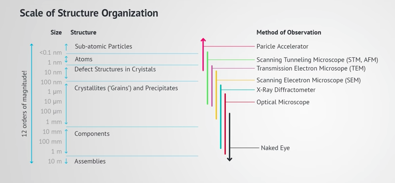
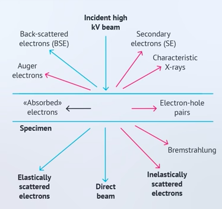
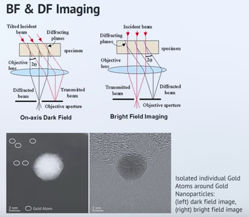
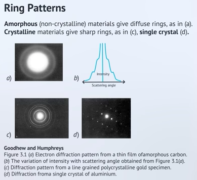

# Notes on XRD/TEM/SEM

## X-ray Diffraction Analysis in MSE
edx course [link](https://youtu.be/gKJxcCE5lZ8)

- XDA to characterize crystalline structure

- structure size ~10 A.
- D-spacing is the spacing between parallel planes in the diffraction processes.
- Bragg formula (if you know the wavelength of incoming radiation, the angle of diffraction, then you can know the d-spacing. $x = d \sin(\theta)$. See [wiki](https://en.wikipedia.org/wiki/Bragg%27s_law).
- Samples 
	1. Powder sample: Bragg-Brentano geometry for powder diffractometer.
	2. Single crystal sample: one set of diffraction peaks
	3. Polycrystalline samples: all possible diffraction peaks
	4. Could NOT be used for amorphous samples
- Different crystal systems (cubic, hexagonal, tetragonal, etc) correspond to different patterns of peaks at miller indices (hkl).

- What XRD CAN do:
	1. internal stress (with single and poly crystals)
	2. Size of crystal grains (with poly crystals and [Scherrer equation](https://en.wikipedia.org/wiki/Scherrer_equation)) 
- What you CANNOT do with XRD
	1. Elemental analysis
	2. Tell me what the sample is? (unless you know something about the sample, powder XRD won't have answers! EM with XRD may give you answer.)
	3. Sample should be at least ~ 100 um thickness, several mm^2 in surface. Imaging extremely thin coating (~um) will also give you information about the substrate.

## TEM (Transmission Electron Miscroscopy)
edx course [link](https://youtu.be/17eZXTHjkZA)

- 3 levels of materials
	1. atomic level affects electrical, magnetic and chemical properties. 
	2. crystalline level affects physical properties, such as cleavage, electronic band structure, and optical transparency. 
	3. microstructure affects physical properties such as strength, toughness, ductility, hardness, corrosion resistance, high/low temperature behavior or wear resistance
- TEM allows the study of atomic structure of a thin piece (<100 nm) of material (lamella) by applying a parallel beam.
- History:
	- Ernest Ruska (1986 Nobel prize for EM)
- Despite short wavelength, image resolution (minimum resolvable detail) is about 1.4 $\mathring{A}$ in most TEMs, limited by **spherical aberrations (Cs)** and for thicker samples, **chromatic aberration (Cc)** of the objective lens. Modern TEMs can reach sub-$\mathring{A}$ resolution - Good enough to see atoms. Cs can be undone using a corrector or using deconvolution software. 
- Lens (EM lens instead of optical ones) have imperfections such as spherical and chromatic aberration. Chromatic aberration results from energy distribution.
- Diagrams of different particles

- TEM gives images of internal structure of a specimen sufficiently thin (~100 nm) to allow transmission of electrons 100-300 kV. 
- The diffraction of electrons give detailed crystallographic information.
- Basic operating modes of TEM
	1. **Bright Field** image only allows transmitted beam to pass through objective aperture. Image is bright when diffraction is weak. 
	2. **Dark Field** image only allows diffracted beam to pass through objective aperture. Image is dark when diffraction is weak. 
	3. Lattice Image: interference of TB (transmitted beam) and DB (diffracted beam) produces an image of the crystal lattice, or even atomic arrangement in the sample. This interfered image is called HRTEM. The image is usually not immediately understandable. Understanding of imaging condition is necessary as it depends on the sample thickness, and electron defocus!
	4. Diffraction pattern: collected at the back focal plane (BFP)
- Example of BF vs DF

- Major image contrast mechanism. When all three mechanisms are present, it is hard to interpret the result. 
	1. Mass-thickness contrast: scatter ~ $Z^2t$. Higher-Z or thicker areas are darker in BF. Applicable to crystalline and amorphous materials.
	2. Diffraction contrast: scattering out of transmitted beam creates contrast due to differences in diffracted intensity. Applicable only to crystalline materials.
	3. Phase contrast: interference between transmitted and diffracted beam produces lattice fringes (typically referred to as HRTEM)
- STEM (scanning transmission electron microscope) mode: a STEM focuses e- beam to a fine probe, as small as 0.1 nm, and scans it cross the specimen in a raster pattern as in SEM. An e- detector below the column measures the transmitted e- intensity which controls the brightness of pixels in STEM image. 

### Comparison of electron (ED) and X-ray diffraction (XD)
1. The wavelength of electrons (e.g., 1.97 pm for 300 keV electrons) is much shorter than that of X-rays (about 100 pm). Therefore, the radius of the Ewald sphere is much larger and more reflections are observed by ED than by XRD.

2. The diffraction angles are very small in ED: 0 < Θ < 2° (cf., XRD: 0 < Θ < 180º)

3. Electrons are scattered by the positive potential inside the electron cloud (Coulomb interaction), while X-rays interact with the electron cloud. As the result, the interaction of electrons with matter is much stronger (106-107×) than that of X-rays. 

- Chemical analysis in TEM: energy dispersive x-ray spectroscopy (EDS)
- EDS makes use of characteristic x-ray spectrum emitted by a solid sample. 
- EELS (electron energy loss spectroscopy) can provide information about valance as well.

### HRTEM vs STEM
youtube [link](https://www.youtube.com/watch?v=nfthm7uCIz0)
- Two methods that gives you the atomic structure of a material.
- HRTEM uses a plane wave and creates diffraction, but STEM uses a focused electron probe. 
- In STEM, the signals are collected in an [annular detector](https://en.wikipedia.org/wiki/Annular_dark-field_imaging) which differentiates low-Z atoms (with less big angle diffractions) and high-Z atoms. 
- STEM images are generally directly interpretable.

### SEM
[link](https://youtu.be/DCiNXJtZmSQ)

# coursera links
https://www.coursera.org/learn/extracellular-vesicles
https://www.coursera.org/learn/cryo-em/home/welcome
https://www.coursera.org/learn/material-behavior
https://www.coursera.org/learn/nanotechnology1/home/welcome
https://www.coursera.org/learn/nanotechnology2
https://www.coursera.org/learn/mosfet/lecture/pY2oy/cmos-processes
https://courses.edx.org/courses/course-v1:MISISx+MSE1x+3T2016/courseware/f2ac0e51533647e5b53033b2bebf44da/9e5e4feeb43b415db4c0798d3ec5400b/?activate_block_id=block-v1%3AMISISx%2BMSE1x%2B3T2016%2Btype%40sequential%2Bblock%409e5e4feeb43b415db4c0798d3ec5400b
